Long Island. CS student. I run [Hack Club](https://hackclub.com) at my school and lead the
V5RC robotics team at Mepham, which in practice means I write the code and then explain to
everyone why the robot did that.

Almost everything I know came from building something that broke first.

### what I actually use

Python and JavaScript daily. TypeScript once a project gets big enough to deserve it.
Flask for backends I want to understand end to end, React and Next.js when the frontend is
doing the heavy lifting. MongoDB or SQLite depending on how much structure I feel like
committing to. Tailwind, Git, Vercel.

Robot side is VEX V5 — autonomous routines, sensor logic, and the reminder that code which
worked in the classroom is not code that works on the competition field.

### things I've built

**[V5RC Robotics Web App](https://github.com/Damon1o/mepham_robotics)** — [live](https://mephamrobotics.vercel.app)
Full-stack app for our robotics program: members, events, competitions, match scouting.
Python, JavaScript, MongoDB. Replaced a spreadsheet nobody kept updated.

**[Hack Club Leader Web App](https://hackclub-leaders.vercel.app/)**
Tooling for club leaders, built on Hack Club Auth. Python and JavaScript.

**This repo** — my portfolio site, and yes, it also happens to be the repo you're reading.
Flask on the back, no framework at all on the front. Every bit of content lives in JSON
files, edited through an admin panel that writes them in place, so there's no database to
run. The background is a canvas particle field that pushes away from your cursor and turns
itself off if you've asked your OS for reduced motion. Dark and light mode are nothing but
CSS variables. It's hand-built past the point of reason, which was the whole point.

### running this repo

Python 3.10+ and pip. That's the whole dependency list worth worrying about.

```bash
git clone https://github.com/Damon1o/Damon1o.git
cd Damon1o

python -m venv venv
source venv/bin/activate        # Windows: venv\Scripts\activate

pip install -r requirements.txt

cp .env.example .env            # Windows: copy .env.example .env
```

Two variables live in `.env`. `SECRET_KEY` is required — Flask signs sessions with it, so
the admin panel won't hold a login without one. `SMTP_PASSWORD` is optional: a Gmail app
password that lets the contact form email you when someone submits it. Leave it unset and
messages still save to JSON, they just don't ping your inbox.

```bash
python app.py
```

Serves on `http://localhost:5000`. Override with `PORT`, and set `FLASK_DEBUG=0` when you
don't want the reloader.

Content is edited at `/admin`. The password comes from `admin_password` in
`static/data/siteConfig.json`, which ships as `admin123` — change it before you host this
anywhere, since that file is committed. Everything the site renders lives in
`static/data/*.json`; the dashboard just rewrites those files in place.

Tests are pytest: `pytest`.

Deployment notes, project layout, and the full page-by-page breakdown are in [DOCS.md](DOCS.md).

### elsewhere

Hackathons: Hack Club Arcade, High Seas, Counterspell. Games, trackers, and one survival
sim I still owe a rewrite.

[linkedin](https://www.linkedin.com/in/damon01/) · [damonlin.contact@gmail.com](mailto:damonlin.contact@gmail.com)
